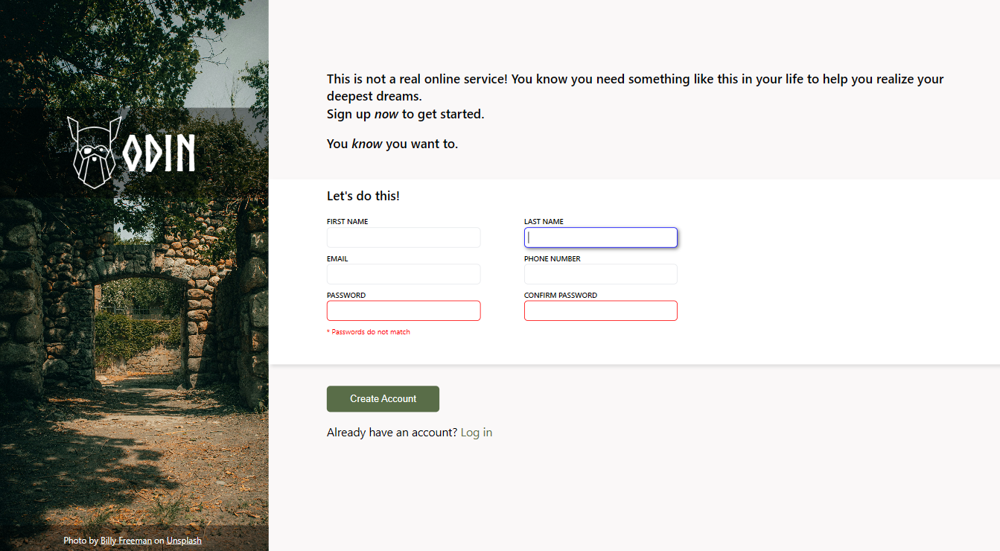

# Sign-up-form

A Signup form based on [Project: Sign-up Form](https://www.theodinproject.com/lessons/node-path-intermediate-html-and-css-sign-up-form) of [The Odin Project](https://www.theodinproject.com/).  

Live preview [here]().  

  

### Definition
A simple signup form to practice html and css with client-side input validation built in within the browser.  

Also, credits to [Billy Freeman](https://unsplash.com/photos/brown-brick-wall-with-green-trees-NTf3jqFzRiU) on Unsplash for the wonderful background image used in this form.  

### Technologies

This form was created using HTML and CSS.

